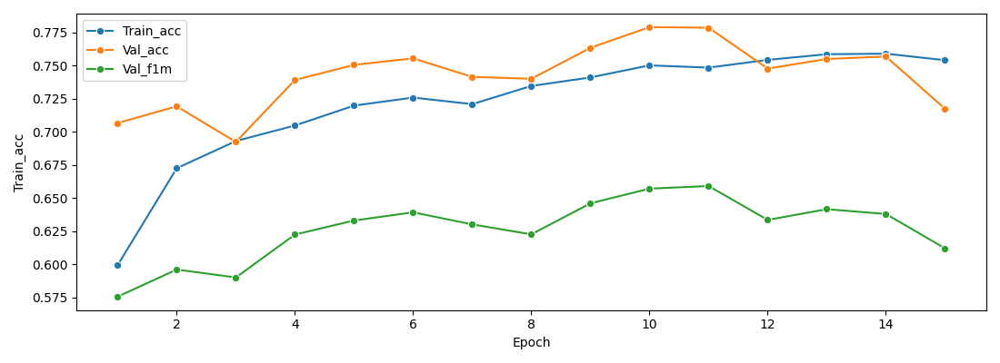
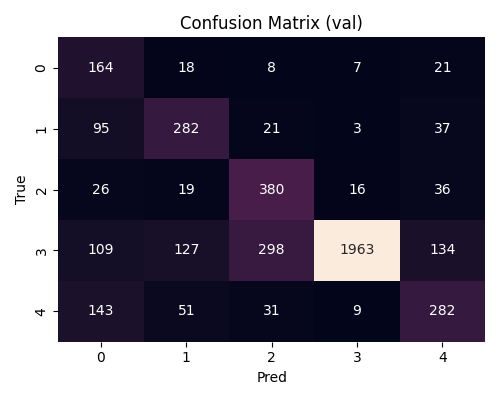
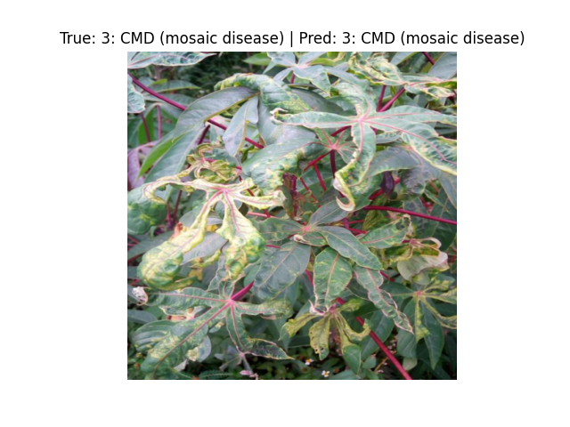

# EDA + Pipeline Classification (ResNet)

Image classification project with **ResNet (18 & 50)** using PyTorch, including **Exploratory Data Analysis (EDA)**, data preprocessing, training pipeline, evaluation metrics, and visualization.
The dataset used is the **Cassava Leaf Disease Classification** dataset.

---

## 📂 Project Structure

```
📂 ResNet_Classification  
 ├── 📄 main_resnet_pipeline.py    # Main script (EDA + training + evaluation)  
 ├── 📄 README.md                  # This file     
 └── 📂 outputs                    # Training plots, confusion matrix, metrics  
```

---

## 🧰 Libraries Used

```python
import os, math, warnings, sqlite3
import numpy as np
import pandas as pd
import matplotlib.pyplot as plt
import seaborn as sns

import torch
import torch.nn as nn
import torch.optim as optim
from torch.utils.data import Dataset, DataLoader, WeightedRandomSampler
import torchvision.transforms as T
from torchvision.models import resnet18, resnet50, ResNet18_Weights, ResNet50_Weights

from sklearn.model_selection import StratifiedKFold
from sklearn.metrics import confusion_matrix, f1_score, classification_report
from torch.cuda.amp import autocast, GradScaler
```

---

## ⚙️ Configurable Parameters

All configs are defined at the beginning of the script:

```python
IMG_SIZE  = 448        # Input image size
BATCH     = 32         # Batch size
EPOCHS    = 15         # Training epochs
LR        = 1e-3       # Initial learning rate
WD        = 1e-4       # Weight decay
SEED      = 69         # Random seed
BACKBONE  = "resnet50" # {"resnet18","resnet50"}
FREEZE    = True       # Transfer learning: freeze backbone at start
USE_SAMPLER = True     # Weighted sampler for class imbalance
```

---

## 🏋️‍♂️ Training the Model

To train on your dataset:

```bash
python main_resnet_pipeline.py
```

### Key Features

* **EDA Class** (CSV/Excel/SQL): missing values, duplicates, types, categorical distributions.
* **Transforms**: ImageNet normalization + light augmentation (flip, color jitter).
* **Backbones**: ResNet18/ResNet50 pretrained on ImageNet.
* **Sampler**: `WeightedRandomSampler` (configurable exponent `power`).
* **Loss**: `CrossEntropyLoss` with **class weighting** (Effective Number of Samples) + **label smoothing**.
* **Scheduler**: `CosineAnnealingWarmRestarts` (without manual warmup).
* **AMP**: Mixed precision with `torch.cuda.amp`.
* **Checkpointing**: saves the **best macro-F1** model.
* **Plots**: training history and confusion matrix.

---

## ⚖️ Class Imbalance Handling

This project includes several strategies to mitigate class imbalance:

**Techniques tested**

* **Weighted Sampler** (`WeightedRandomSampler`) with configurable **power** exponent (here: `power=1.0`).
* **Class weighting** in loss using the **Effective Number of Samples** (Cui et al., 2019).
* **Label smoothing** in `CrossEntropyLoss` to improve calibration and robustness (here: `0.005`).
* **Image size tuning** (larger inputs improved separation of minority classes).
* **Progressive unfreezing**: backbone unfrozen from epoch 2, with **LR reduced to 1/10** for stable fine-tuning.
* **Scheduler**: `CosineAnnealingWarmRestarts` (without manual warmup) to escape poor local minima for minority classes.

**💡 Best performing recipe**

* **Backbone**: `ResNet50` (pretrained)
* **Sampler**: `WeightedRandomSampler` with **power = 1.0**
* **Loss**: `CrossEntropyLoss(weight=effective_number_weights, label_smoothing=0.005)`
* **Image size**: **448**
* **Training**: **15 epochs**
* **Progressive unfreezing**: from **epoch 2**, with **LR/10** and `weight_decay=5e-5`
* **Scheduler**: `CosineAnnealingWarmRestarts` (no manual warmup)
* **Optimizer**: `AdamW (lr=1e-3, wd=1e-4)` → then **lr/10** at unfreeze

This recipe achieved the **highest macro-F1 score** while improving sensitivity to minority classes and keeping training stable.

---

## 🎥 Example Workflow

1. Load `train.csv` (`image_id,label`) and run **EDA**.
2. Perform stratified split (5-fold, first fold used for train/val).
3. Apply **weighted sampler** and **class-weighted loss**.
4. Train with **AMP**, checkpoint on **macro-F1**.
5. **Unfreeze backbone** at epoch 2 with **reduced LR/WD**.
6. Evaluate with **curves**, **confusion matrix**, **classification report**.

---

## 📊 Results & Metrics

During training the following are tracked:

* **Train/Val Loss**, **Accuracy**, **Macro-F1**

Outputs include:

* Training history plots (loss, acc, F1)
* **Confusion matrix**
* **Per-class report** (precision, recall, F1)



---

## ✒️ References

* Cui et al., 2019 — *Class-Balanced Loss Based on Effective Number of Samples*
* Dataset: [Cassava Leaf Disease Classification (Kaggle)](https://www.kaggle.com/competitions/cassava-leaf-disease-classification)

---

## 🤝 Contributions

This project is part of my professional portfolio.
Suggestions, improvements, or feedback are welcome!

---

## 📬 Contact

**Britez Santiago** — ([https://www.linkedin.com](https://www.linkedin.com/in/santiago-luis-britez-101a8a217/))
